F5 Cloud Services – API Lab
===========================
Spring 2020

.. contents:: Table of Contents

Overview
########

This lab will take you through setting up and basic usage of the following F5 Cloud Services:

* **F5 DNS Cloud Service**: secondary DNS backed by globally-distributed anycast network with built-in DDoS protection

* **F5 DNS Load Balancer Cloud Service**: global availability and performance with health-check and built-in DDoS protection

* **F5 Essential App Protect Service**:  mitigate risk of exploits, targeted attacks & threats to web applications

In the course of this lab you will create application infrastructure using F5 Cloud Services to support:

* Secondary DNS for backup of primary with high availability, scale & security

* Secondary DNS and DNS load balancing services with DDoS protection

* Load balance pools of app instances across multiple clouds (Azure & AWS)

* Geo-proximity traffic routing for performance and/or compliance (GDPR, etc.)

* Web app protection against common high-risk web exploits

* Application protection against external IPs flagged as malicious

* Risk mitigation against coordinated attack trends & vulnerabilities

The estimated time to complete the lab is ~45 minutes.

Prerequisites
##############

* F5 Cloud Services account: sign up `here <http://bit.ly/f5csreg>`_

* Postman: download `here <http://bit.ly/309wSLl>`_

* An alternate email address: for limited-user role

Environment and Setup
#####################

1. APIs and Services
*********************

The setup & configuration of the services will be done by sending API requests to the following services:

* **F5 Cloud Services API**: create, use, and remove the services in the scope of this lab

* **Lab service API**: facilitates auxiliary functions for the lab only: creating DNS entries, sending targeted requests & traffic to the apps/services, etc.

The following diagram captures the core components of this Lab:

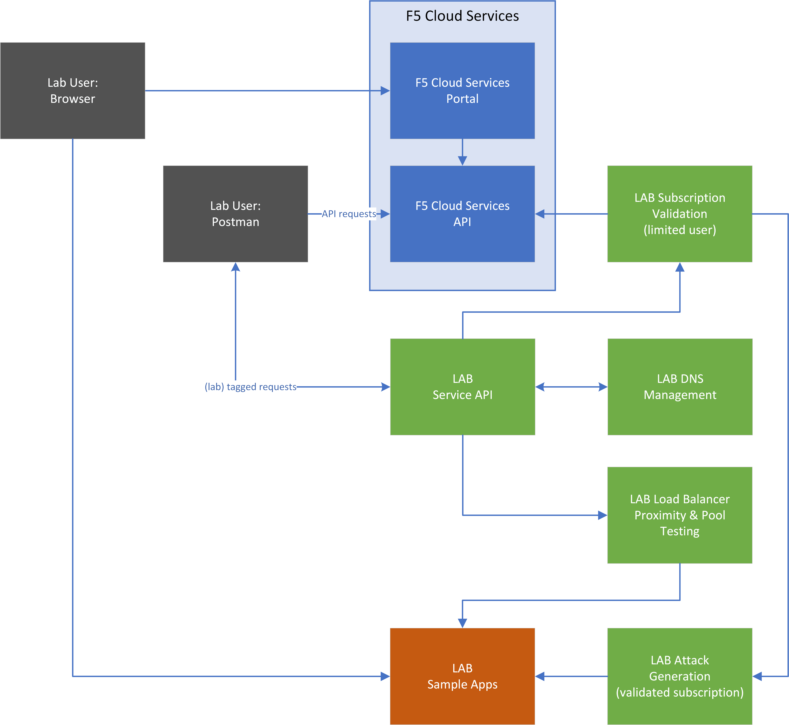

2. Application Scenario
***********************

In order to fully explore the capabilities of F5 Cloud Services, you will be able to use an existing application with a set of live instances across different clouds and geographic locations. This app is `"BuyTime Auction" <http://bit.ly/37fVwfX>`_, a fictitious multi-instance deployment that helps to simulate a globally deployed app topology. Unsurprisingly, robust security, global availability, zero downtime,
and performance are critical for this application, while the app Developers & DevOps are used to consuming app infrastructure as-a-Service.

The following are the demo application instances:

.. csv-table::
   :header: "Name", "Geography", "Cloud/Region", "IP", "URI"

   "AU", "Australia", "AWS - Asia Pacific (Sydney)", "54.206.13.195", "http://au-auction.cloudservicesdemo.net/"
   "EU", "Europe", "AWS – Europe (Frankfurt)", "3.122.191.227", "http://eu-auction.cloudservicesdemo.net/"
   "NA1", "North America", "AWS - US East (N. Virginia)", "34.229.48.248", "http://na1-auction.cloudservicesdemo.net/"
   "NA2", "North America", "AWS – US East (N. Virginia)", "18.232.64.254", "http://na2-auction.cloudservicesdemo.net/"
   "NA3", "North America", "Azure – US East", "13.82.106.211", "http://na3-auction.cloudservicesdemo.net/"

The following diagram is a simplified architecture of the Auction application:

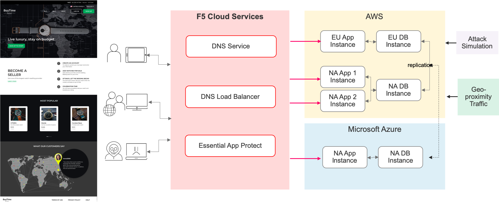

3. Postman Configuration
************************

`a)` Open Postman, create a Postman account if you don’t have one and choose to do so, and sign in.

`b)` Import collection – **F5 Cloud Services LAB.postman_collection.json** and environment – **F5 Cloud Services LAB.postman_environment.json**.

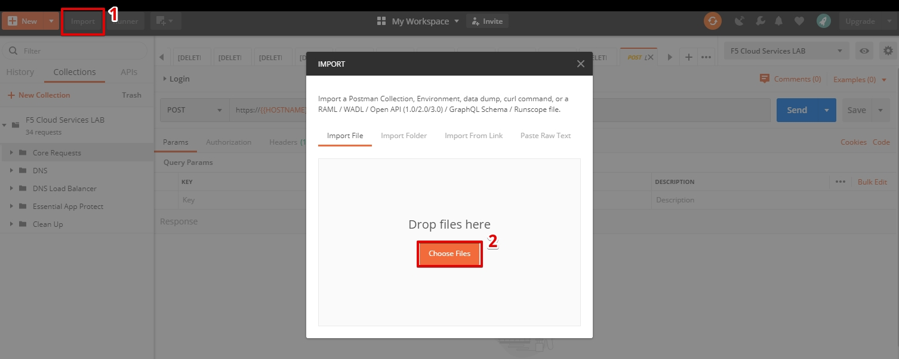

You will now see your collection (left side) with calls in several categories, as well as environment variables (top right).

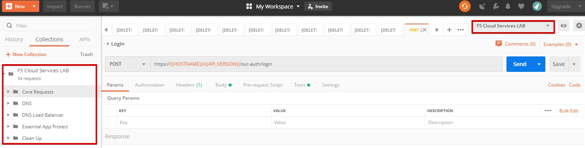

You are now ready to interface with F5 Cloud Services using Postman.

4. Postman Environment Variables Detail
***************************************

The Postman environment contains a number of variables. To see them, select **Manage Environments** and click **F5 Cloud Services LAB**.

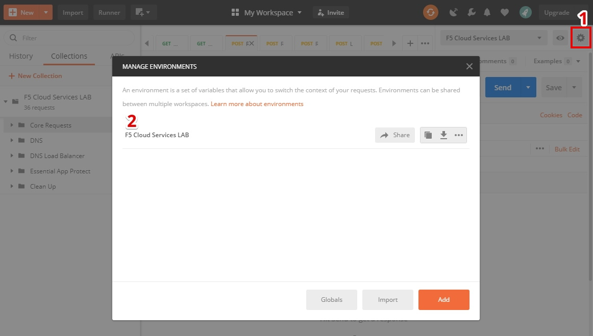

You will now see the list of environment variables:

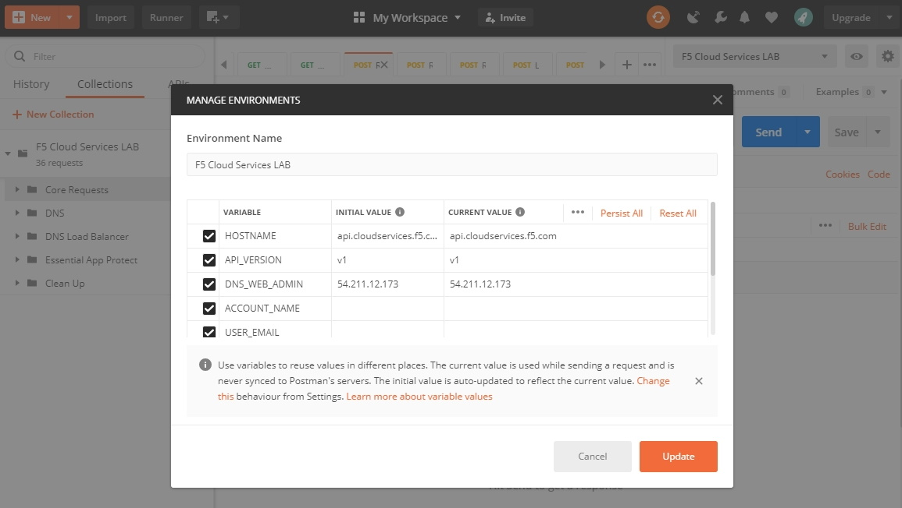

You will later need to add the variables highlighted in bold.

.. csv-table::
  :header: " ", "Variable", "Description"
  :widths: 5, 15, 40

  "1", "HOSTNAME", "F5 API URL"
  "2", "API_VERSION", "Version of API used"
  "3", "DNS_WEB_ADMIN", "Labs DNS API"
  "4", "ACCOUNT_NAME", "Name of your F5 Cloud Services portal account which is retrieved in Get User Membership call to get account ID to work in"
  "5", "**USER_EMAIL**", "**Email of the main user in the F5 Cloud Services portal**"
  "6", "**USER_PASSWORD**", "**Password of the main user in the F5 Cloud Services portal**"
  "7", "ACCESS_TOKEN", "Token for authenticating API calls used by your main user account"
  "8", "**LIMITED_USER_EMAIL**", "**Email of an alternate user with a “limited-user” role (for the lab)**"
  "9", "**LIMITED_USER_PASSWORD**", "**Password of an alternate user with a “limited-user” role (for the lab)**"
  "10", "LIMITED_ACCESS_TOKEN", "Token for API calls made by the lab (verify your subscriptions, etc)"
  "11", "USER_ID", "ID of your main user"
  "12", "ACCOUNT_ID", "ID of your main user’s primary account (where you will create instances)"
  "13", "LIMITED_USER_ROLE_ID", "Unique identifier of a “limited-user” role type"
  "14", "DNS_CATALOG_ID", "Unique ID for DNS service catalog"
  "15", "WAF_CATALOG_ID", "Unique ID for the Essential App Protect service catalog"
  "16", "GSLB_CATALOG_ID", "Unique ID for the DNS Load Balancer service catalog"
  "17", "ZONE_NAME", "Your test DNS zone which is assigned by the LAB Service API"
  "18", "DNS_SUBSCRIPTION_ID", "Your instance ID for the DNS subscription"
  "19", "WAF_SUBSCRIPTION_ID", "Your instance ID for the Essential App Protect subscription"
  "20", "GSLB_SUBSCRIPTION_ID", "Your instance ID for the DNS Load Balancer subscription"
  "21", "WAF_SERVICE_INSTANCE_ID", "The ID of the app instance in your Essential App Protect subscription"
  "22", "WAF_CNAME", "CNAME record for the app instance in your Essential App Protect subscription"

Core API Calls
##############

5. Login
********

`a)` Open the “F5 Cloud Services LAB” environment variables by clicking the “Environment Quick Look”, click into the field of the corresponding variable, and type the value of your main user email in the variable “USER_EMAIL” (click **Enter** after typing the values).

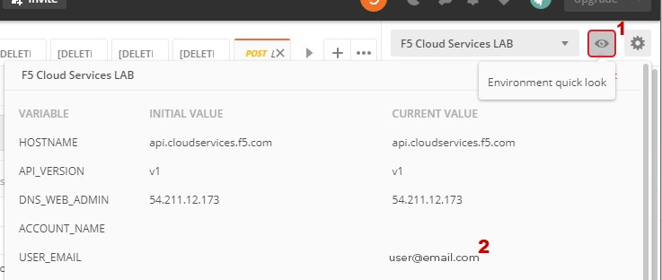

   Repeat the same for the “USER_PASSWORD”.

`b)` Select the **Login** request in the sidebar to login to your F5 Cloud Services profile and click **Send** to get the authorization token described above. More detailed information on this API request can be found `here <http://bit.ly/36ffsyy>`_.

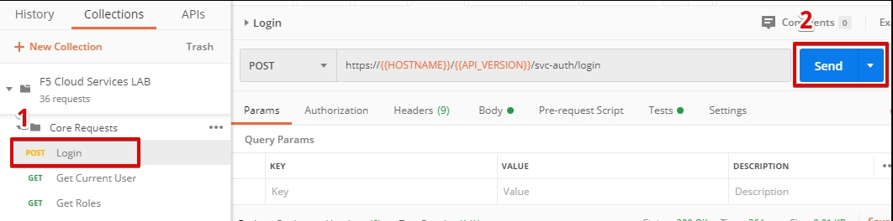

A successful login will result in Postman returning the tokens from the API, shown in the response body below:

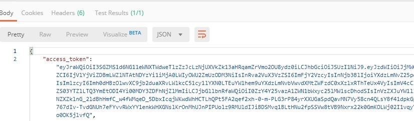

These tokens are then stored for subsequent calls using a function inside Postman to set environment variables. You can see the test function in the “Tests” tab:

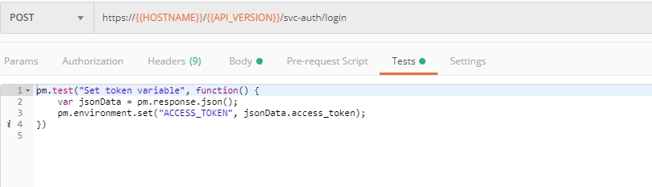

**NOTE**: If any of the subsequent Postman calls return a blank response or **"status": "unauthorized"** response (see the screenshot below), it means your user token has expired and you will need to re-login. To do that you just need to re-send the **Login** and **Limited User Login** requests.

.. figure:: _figures/10.jpg
        :height: 60px
        :width: 200 px
        :scale: 230 %
        :alt: alternate text
        :align: center

`c)` Retrieve User ID & Account ID

Select the **Get Current User** request and click **Send** to retrieve User ID and Account ID to be used in the further requests.

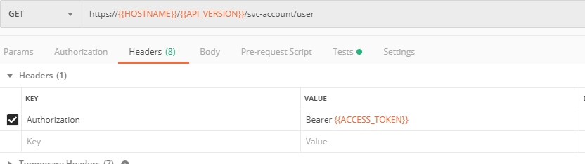

The response returns the following detail:

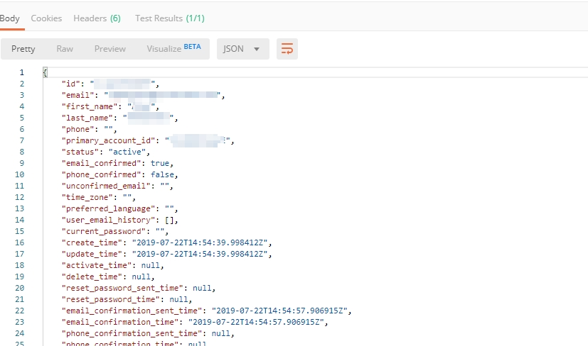

The retrieved User ID and Account ID are then stored for subsequent calls.

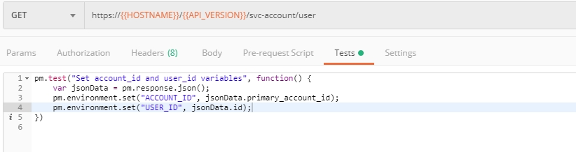

More detailed information on this API request can be found `here <http://bit.ly/37hyQw3>`_.

6. Limited Rights User Configuration
************************************

The Lab API calls utilize tokens to interface with the F5 Cloud Services API and the Lab Service API. For enhanced security, it’s recommended* that you create a separate user in the F5 portal with a “limited-user” role. This limited user’s token (“LIMITED_ACCESS_TOKEN” in the table above) will then be used by the Lab service API for auxiliary requests & services.

`*` **NOTE**: it is possible for you to use the lab with just your main user credentials (Privileged User role) and re-use their token (“ACCESS_TOKEN” in the table above) as the “LIMITED_ACCESS_TOKEN”. To do that copy the value of “ACCESS_TOKEN” into the “LIMITED_ACCESS_TOKEN”.

To create a limited user role, you can either (a) use the F5 Cloud Services portal to send an email invite to your alternate (limited-user) email, or (b) alternatively complete the invitation using the API. Pick a path option a) or b) to proceed below.

`a)` Limited User invitation through the F5 Cloud Services portal

   `1.` Log into the F5 Cloud Services portal with your main user/password.

   `2.` Go to **Accounts** (left panel), select **Users** and hit the **Invite** button. Fill in the required information and make sure to select “Limited User” role.

   .. figure:: _figures/13.jpg

   `3.` Go to your **Name** (top right corner) and **Sign Out (important)**. You will be signed out as the main user.

   `4.` Open the F5 Cloud Services portal invitation email, **Accept invitation** and complete the registration by creating a password.

   .. figure:: _figures/14.jpg

   `5.` If you haven’t created F5 Cloud Services account for your limited user, you’ll need to do so now (`Register <https://portal.cloudservices.f5.com/register>`_).

   Use the alternate email to register. 

   .. figure:: _figures/85.jpg

   `6.` Return to **Postman** and add your limited-rights user name & password to the “LIMITED_USER_EMAIL” and “LIMITED_USER_PASSWORD” variables.

   .. figure:: _figures/16.jpg

`b)` Limited User invitation through the API (skip if you’ve added the limited-user through the F5 Cloud Services portal):

   `1.` **Get Roles**

   Select the **Get Roles** request and click **Send**. You will get descriptions of available roles, including their Role IDs.

   .. figure:: _figures/87.jpg

   You will get limited user's “role_id”.

   .. figure:: _figures/18.jpg
      :height: 140px
      :width: 140 px
      :scale: 230 %
      :alt: alternate text
      :align: center

   The retrieved limited user's “role_id” is then stored for subsequent calls.

   .. figure:: _figures/17.jpg
      :height: 60px
      :width: 190 px
      :scale: 230 %
      :alt: alternate text

   More detailed information on this API request can be found `here <http://bit.ly/2tIWwe2>`_.

   `2.` **Invite Limited User (optional)** request will generate an invitation using the API to the alternate (limited user) email. You will need to add the alternate email in the Environment variable “LIMITED_USER_EMAIL” before sending the request.

   .. figure:: _figures/19.jpg
      :height: 115px
      :width: 220 px
      :scale: 200 %
      :alt: alternate text

   The body of the request is below:

   .. figure:: _figures/20.jpg
      :height: 120px
      :width: 220 px
      :scale: 200 %
      :alt: alternate text

   The response will return the “invite_id”, “role_id”, user email and other information related to the invitation and the limited user.

   .. figure:: _figures/21.jpg
      :height: 130px
      :width: 140 px
      :scale: 200 %
      :alt: alternate text

   More detailed information on this API request can be found `here <http://bit.ly/36cSB6J>`_.

   `3.` A limited user needs to accept the invitation (open the email with the invitation) and create a password to log in the F5 Cloud Services portal.

   `4.` After that, you will need to return to Postman and add Limited User Password in the Environment variable “LIMITED_USER_PASSWORD”.

   .. figure:: _figures/22.jpg
      :height: 115px
      :width: 220 px
      :scale: 200 %
      :alt: alternate text

7. Log in as Limited User
*************************

At this point, you should either have a limited user created, or decided to re-use your main user token as a limited user token*. If you created limited user, let’s use the environment variables you’ve added for the limited user to log in & retrieve “LIMITED_ACCESS_TOKEN”.

Select the **Limited User Login (optional)** request and click **Send**.

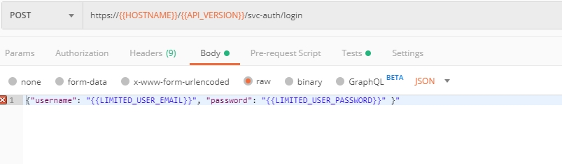

A successful login will result in Postman returning the tokens from the API, shown in the response body below:

.. figure:: _figures/88.jpg

After successful authentication you will see that Postman retrieves and stores the access token which will be stored into “LIMITED_ACCESS_TOKEN” variable to be used later.

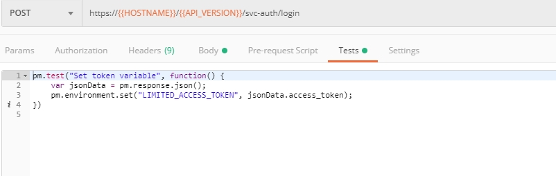

More detailed information on this API request can be found `here <http://bit.ly/36ffsyy>`_.

`*` **NOTE**: If you did not create a limited user and you’re comfortable using the main Privileged User for the entirety of the lab, you can copy the value of “ACCESS_TOKEN” into the “LIMITED_ACCESS_TOKEN”.

8. Get the Zone Name for your Lab
*********************************

This Lab contains an API that provides utility functions including DNS management, geo proximity load balance testing, and limited (targeted) attacks on specific instances. The first step to identify your individual lab is to retrieve the Zone Name for your lab with the following API Call:

**Get DNS Zone (lab)**

Click **Send**. This call will pass your “LIMITED_ACCESS_TOKEN” in the header of the request to the Labs API in order to validate existence of your F5 account & return back a ZONE name unique to your lab.

Request:

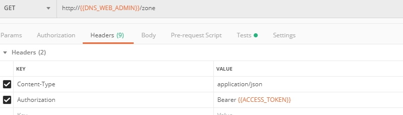

The response will return your test DNS zone **name** and the status.

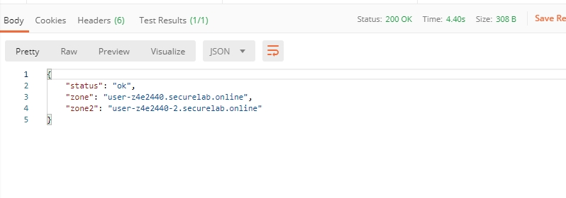

Sending this request will automatically capture of the ZONE variables:

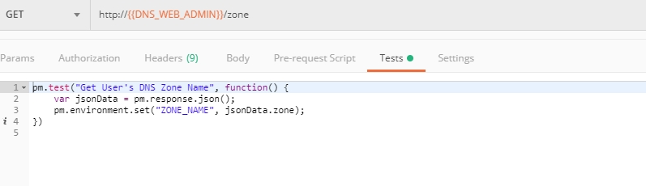

This ZONE name will be used throughout the lab as the domain name for your test applications.

9. User Account Operations
**************************

`a)` Get User Membership to F5 Cloud Services accounts

**Get User Membership** returns info on your main user’s access to F5 Cloud Services accounts, which are owned/full rights and which are limited.

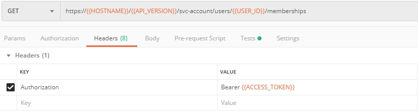

You will see account ids, names, roles and other information in the body of response. The “role_id” will correspond to the unique IDs returned in section 6.b.1.

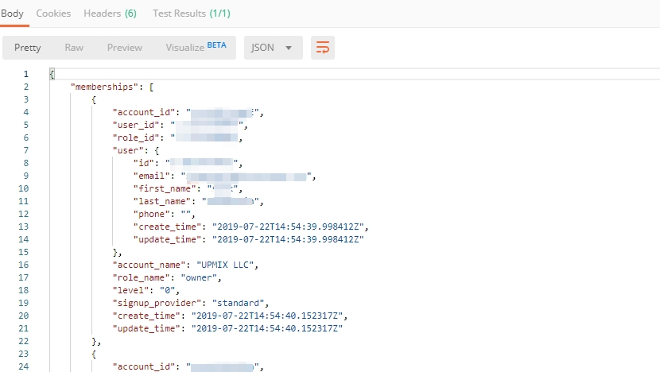

Your "account_id" will be retrieved using "account_name" and used for creating user's instances.

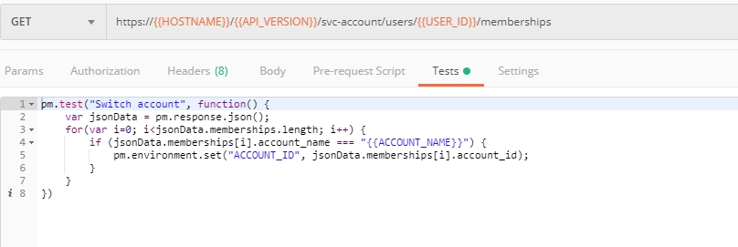

More detailed information on this API request can be found `here <http://bit.ly/2Gfu1r3>`_.

`b)` Retrieve information on available catalogs and their IDs

Select the **Get Catalogs** request and click **Send** to retrieve data about the available Catalogs and their IDs.

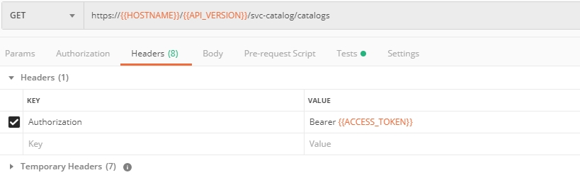

As you see there are a number of catalogs available:

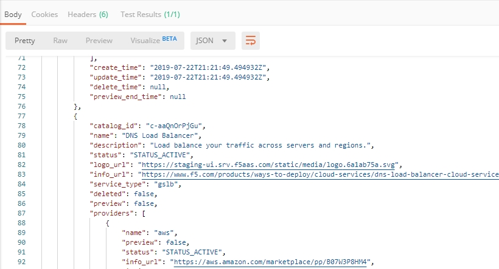

The retrieved IDs are then stored for subsequent calls using a function inside Postman to set environment variables. You can see the test function in the "Tests" tab:

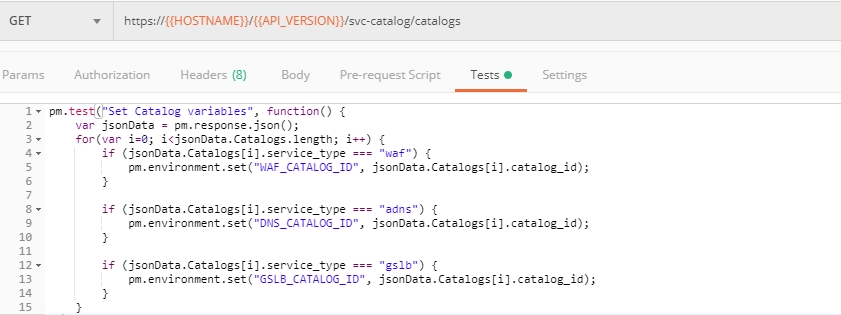

More detailed information on this API request can be found `here <http://bit.ly/36j1Yl4>`_.

`c)` Subscribe to Catalogs using the F5 Cloud Services portal

You can subscribe to any of these cloud service catalogs by using the portal or API (assuming you already provided payment / credit card info to enable certain catalogs). There may be free tier and trials that you could take advantage of, see the available options next to each catalog!

Portal:

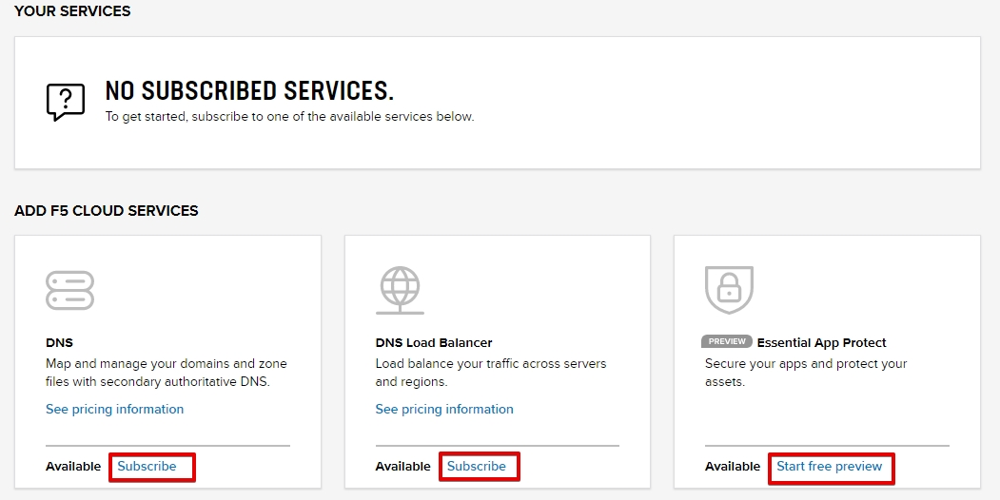

If you haven’t already, you will need to add your payment information or subscribe through AWS Marketplace:

.. figure:: _figures/33.jpg

Add payment card to pay by credit card...

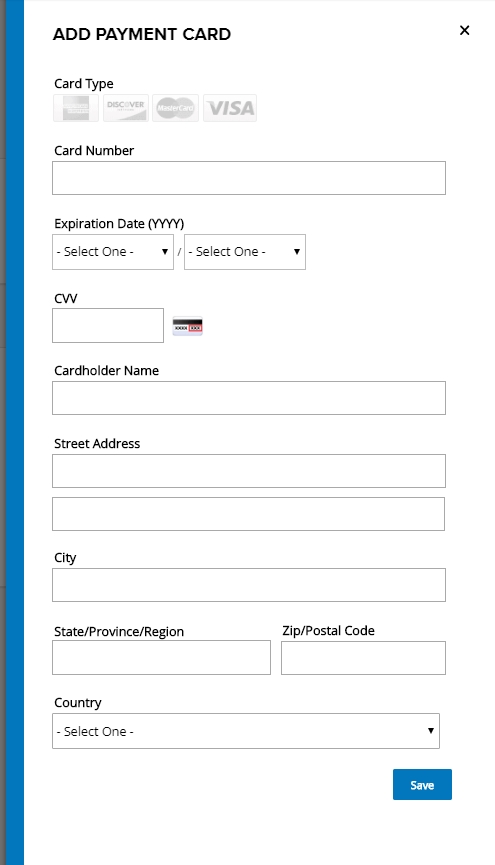

...or initiate the subscription from AWS Marketplace:

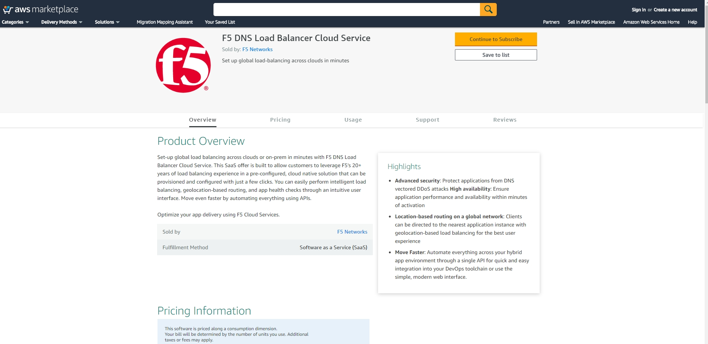

At the time of writing Essential App Protect service provides a free trial, which you can use for the purposes of this lab:

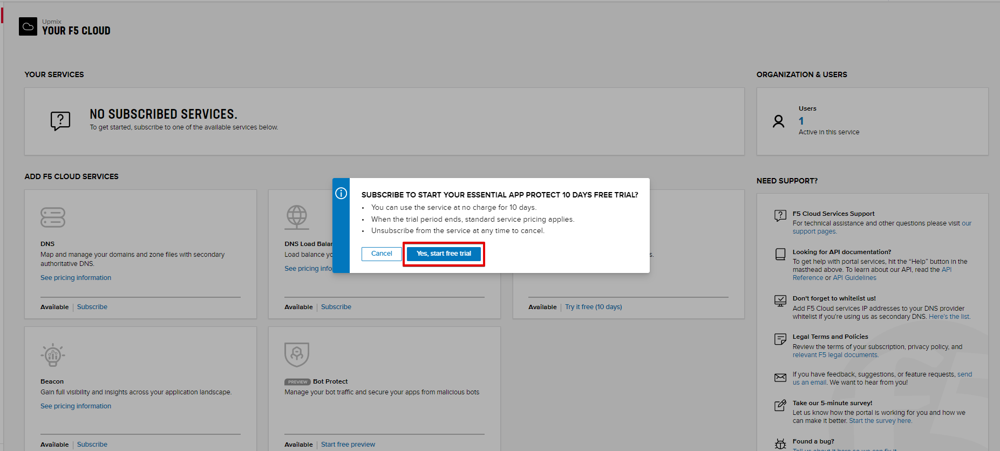

`d)` Subscribe to Catalog using Postman

   `1.` Get the ID of the catalog you want to subscribe to. In the earlier example (see point 9.c), the DNS Load Balancer has a “catalog_id” value of “c-aaQnOrPjGu”.

   `2.` Subscribe to Catalog using API

   **Subscribe to Catalog** request will pass your primary account info (“account _id”) as well as the ID of the desired catalog. From the previous step, we can subscribe to ID “c-aaQnOrPjGu” by replacing the value of “catalog_id” in the Body of the request:

   .. figure:: _figures/34.jpg
      :height: 50px
      :width: 170 px
      :scale: 230 %
      :alt: alternate text

   The resulting response will confirm subscription to the service:

   .. figure:: _figures/105.jpg
      :height: 100px
      :width: 140 px
      :scale: 200 %
      :alt: alternate text

   This API call can be repeated to subscribe to all desired catalog. Within the scope of this lab there are the following catalogs:

   .. csv-table::
     :header: "Catalog", "Catalog_ID"
     :widths: 5, 4

     "DNS", "c-aaxBJkfg8u"
     "DNS Load Balancer", "c-aaQnOrPjGu"
     "Essential App Protect", "c-aa9N0jgHI4"

   You can repeat this call any number of times for different catalogs you’d like to subscribe by changing the “catalog_id” value.

   `3.` Get Previously Created Subscriptions

   If you have already created subscriptions, you can see them by sending **Retrieve Previously Created Subscriptions**:

   .. figure:: _figures/91.jpg

   The response will show subscriptions IDs using which you will be able to retire them in the “clean up” section of this lab.

   .. figure:: _figures/29.jpg
      :height: 130px
      :width: 140 px
      :scale: 200 %
      :alt: alternate text

F5 DNS Cloud Service
###################

1. List DNS Subscriptions
**************************

You can check your available zones sending the **List DNS Subscriptions** request.

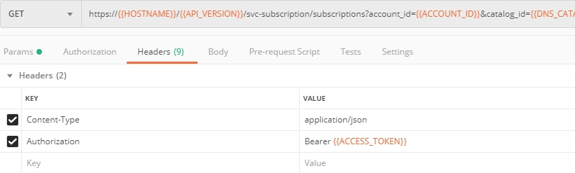

The first DNS Zone you create is free and the following zones will incur charges.

You will see the list of your subscriptions (if any), including subscription IDs, account IDs, user IDs and other related information.  If you don’t have any subscriptions, you will see the following response:

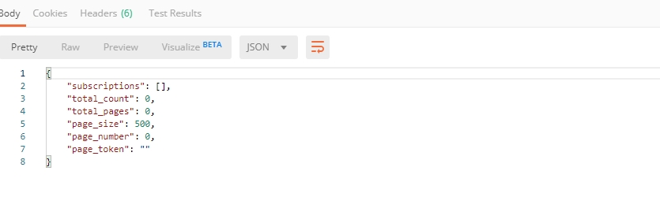

More detailed information on this API request can be found `here <http://bit.ly/30Ixkk5>`_.

2. Create DNS Subscription
**************************

Select the **Create DNS Subscription** request and click **Send** to create a new service instance of Secondary Authoritative DNS using “account_id” and “catalog_id” retrieved a few steps above.

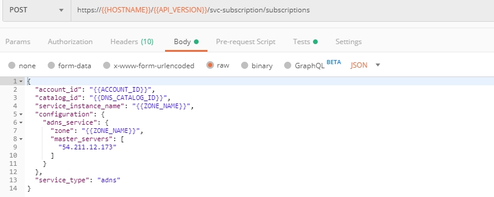

You will see “subscription_id” and created “service_instance_id” in the body.

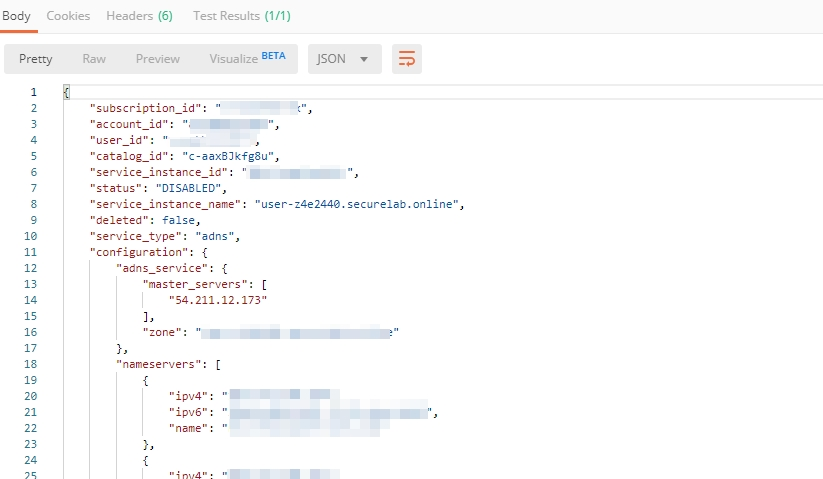

The retrieved "subscription_id" is then stored for subsequent calls.

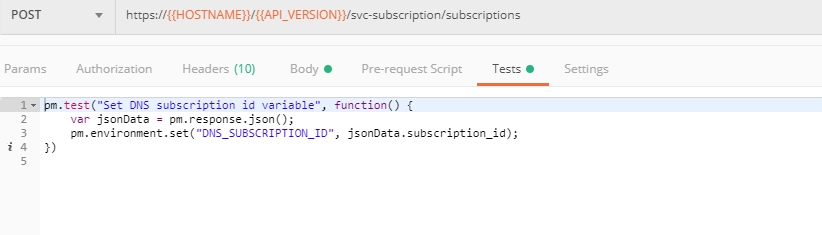

You can change its status from “DISABLED” to “ACTIVE” sending the **Activate DNS Subscription** request below.
More detailed information on this API request can be found `here <http://bit.ly/36fvHLX>`_.

3. Activate DNS Subscription
****************************

Select the **Activate DNS Subscription** request and click **Send**. This will deploy the secondary DNS using “subscription_id” captured in one of the steps above.

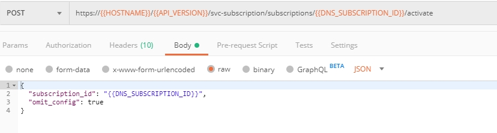

You will see “active” subscription status.

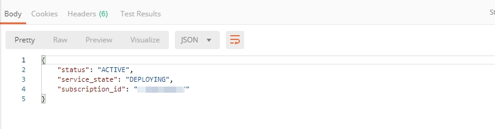

Note that it takes some time to deploy the service, so you can just re-send the same request after a few minutes to see “service_state”: “DEPLOYED”.

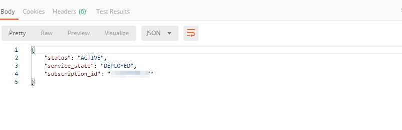

More detailed information on this API request can be found `here <http://bit.ly/36h6tgj>`_.

4. Get DNS Subscription Zones
*****************************

Send the **Get DNS Subscription Zones** request which uses DNS “subscription_id” created a few steps above.  This will retrieve a zone file from your primary DNS server.

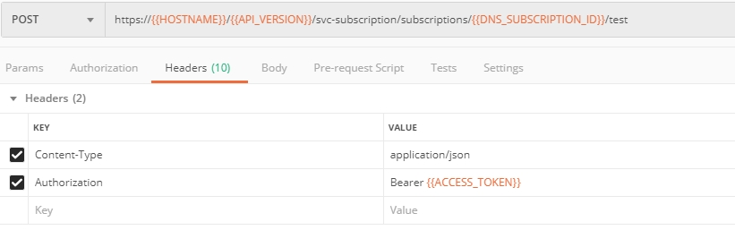

As a result, you will get the zone file describing your DNS zone and containing mappings between domain names and IP addresses.

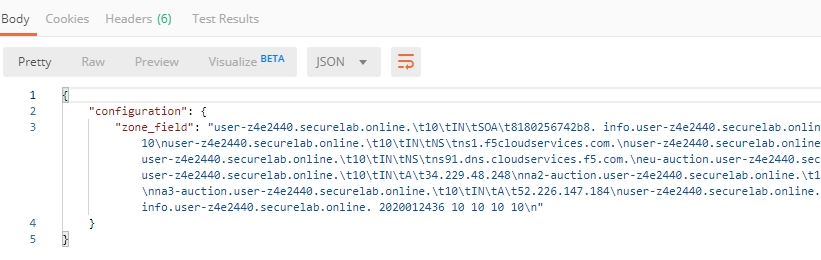

F5 DNS Load Balancer Cloud Service
##################################

1. Create DNS Load Balancer Subscription
****************************************

Select the **Create GSLB Subscription** request and click **Send** to create a new service instance of DNS Load Balancer using “account_id” and “catalog_id” retrieved a few steps above.

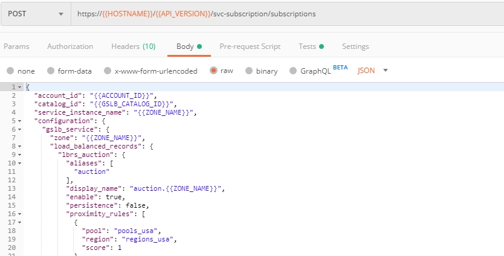

You will see “subscription_id” and created ”service_instance_id” in the body. You may also note that this request will create *only* NA1 endpoint for now. Some more will be created in the subsequent requests.

You may also notice that the current proximity rule is set to send traffic from Anywhere to "usa" pool. This means that only one endpoint (NA1) will be serving all requests now. We will subsequently configure proper load balancing and geoproximity rules.

    .. figure:: _figures/48.jpg
        :height: 210px
        :width: 180 px
        :scale: 160 %
        :alt: alternate text
        :align: center

The retrieved "subscription_id" is then stored for subsequent calls.

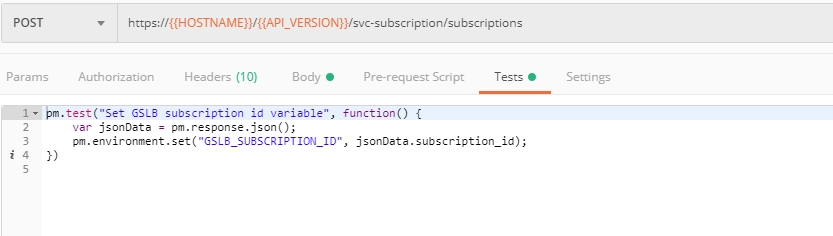

You can change its status from "DISABLED” to “ACTIVE” sending the **Activate GSLB Subscription** request below.

More detailed information on this API request can be found `here <http://bit.ly/36fvHLX>`_.

2. Activate DNS Load Balancer Subscription
******************************************

Select the **Activate GSLB Subscription** request and click **Send**. This will deploy DNS Load Balancer using “subscription_id” captured in one of the steps above.

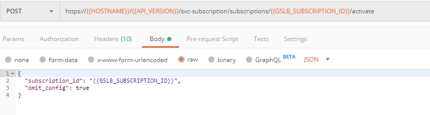

You will see “active” subscription status.

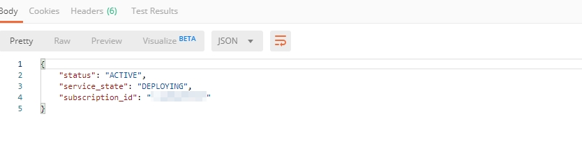

Note that it takes some time to deploy the service, so you can just re-send the same request after a few minutes to see “service_state”: “DEPLOYED”.

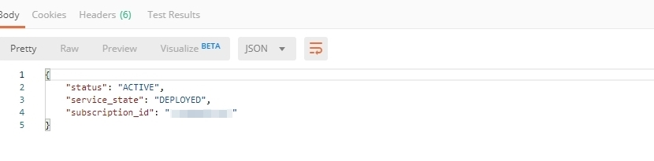

More detailed information on this API request can be found `here <http://bit.ly/36h6tgj>`_.

3. Test NA Pool
***************

Send the **Test NA Availability (lab)** request to execute a call against the Lab service API, which in turn uses an external VM (located in the USA) to run a "wget" to retrieve the response from http://auction.cloudservicesdemo.net. This should show the only available instance NA1 in the HTML that is returned.

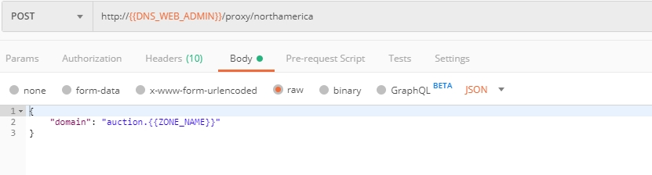

The response shows that your first instance is available:

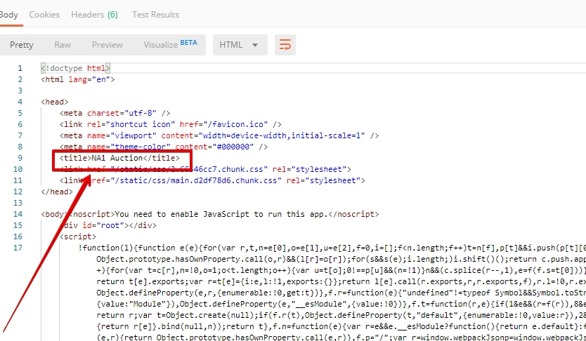

4. Add Endpoints & Pool Members (NA3)
*************************************

Send the **Add Endpoint & Pool Members** request to add a few more endpoints for load balancing of the application. Note that three of the new endpoints (AU, EU and NA2) are deployed on Amazon AWS, and one (NA3) is running on Microsoft Azure. NA1, NA2, and NA3 endpoints are aggregated into a pool "usa", which demonstrates multi-cloud load balancing.

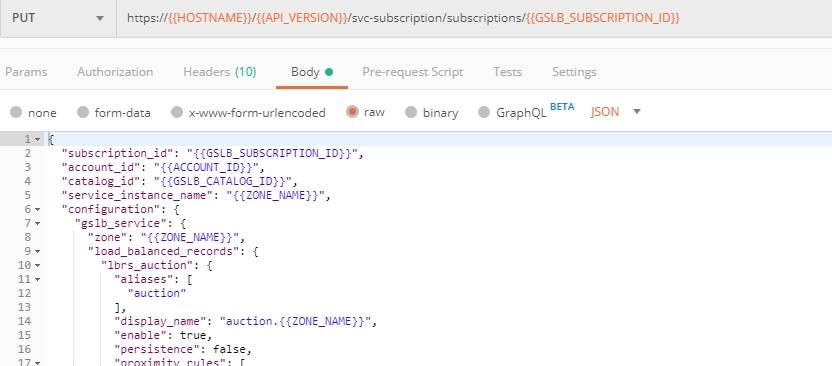

You will see all the information on the added endpoints:

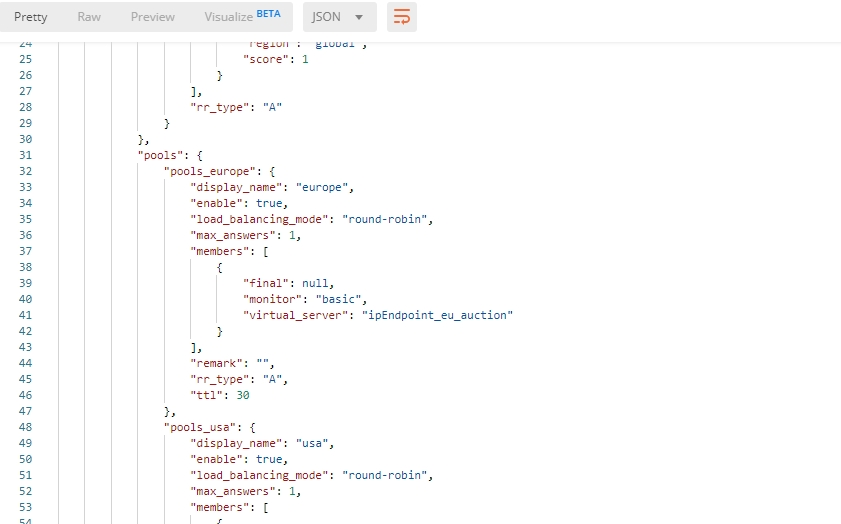

5. Test Round Robin (lab)
*************************

Run the **Test Round Robin (lab)** request to check the response from the Lab service API to test what instance is now being returned. This should show a result different from the previous due to the newly-configured round-robin load balancing.

NOTE: it's possible that you will still get the same endpoint in the response due to either DNS caching or 1/3 chance of the same endpoint to be pulled from the load-balance pool. Let's try:

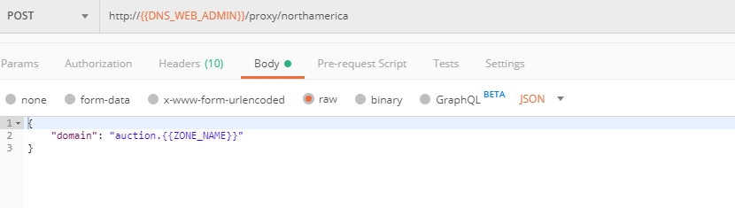

And check the response:

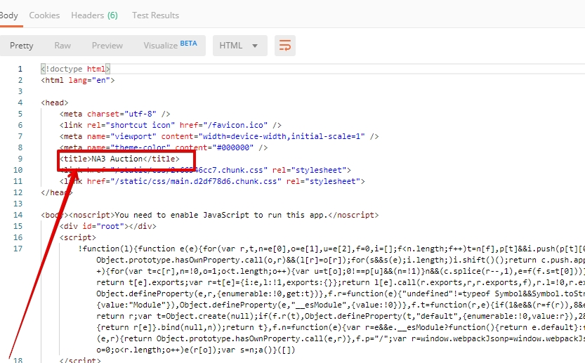

You can send the same request to check other instances.

6. Update Proximity Rule
************************

Run the **Update Proximity Rules & Regions**. This adds new regions "europe" and “australia”, and assigns EU and AU endpoints accordingly. It also updates the DNS Load Balancer with new proximity rules: to send the traffic originating in Europe to the "europe" pool, and traffic from Australia to the “australia” pool, utilizing a higher relative score than the previous rule of routing traffic from "Anywhere" to the "usa" pool. This type of geo-proximity based routing is useful for GDPR compliance.

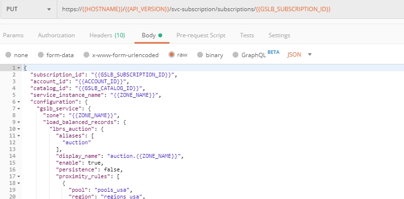

And you will see all the information on available pools and regions:

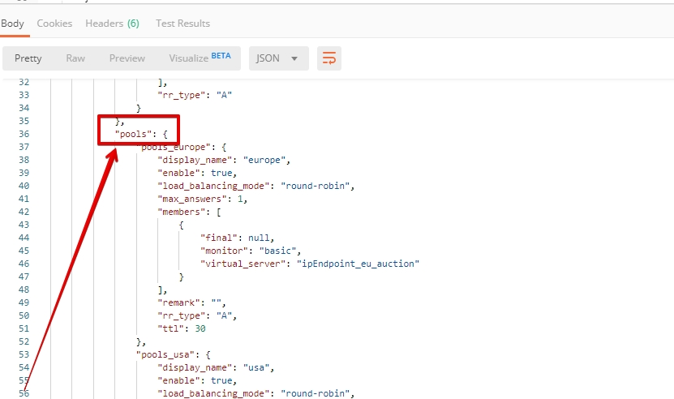

7. Test Proximity Rules (lab)
*****************************

Send the **Test Proximity Rules (lab)** request, which uses an external VM (located in Europe) to run a "wget" to retrieve the response from http://auction.cloudservicesdemo.net. This simulates what an EU-based customer would see when opening this URL in their browser.

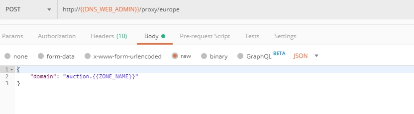

Here’s what you should see in the response:

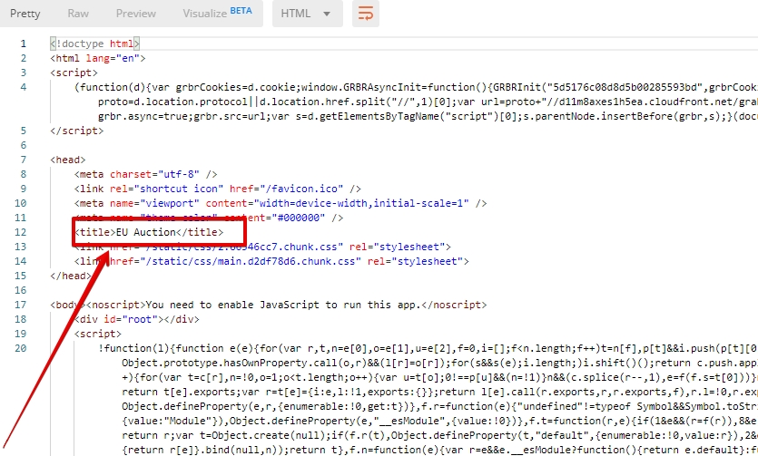

F5 Essential App Protect Service
###############################

1. Create EAP Subscription
**************************

Now, let's protect the NA2 endpoint with an instance of F5 Essential App Protect service. We will start with creating a subscription and retrieving the "subscription_id" for the newly-created instance.

Select the **Create EAP Subscription** request and click **Send** to create a new service instance of Essential App Protect. Note that this request passes the “account_id” and “catalog_id” values retrieved from the previous steps.

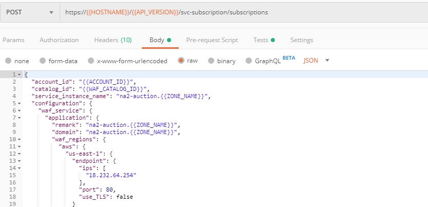

You will see “subscription_id” and created “service_instance_id” in the body used for the subsequent requests.

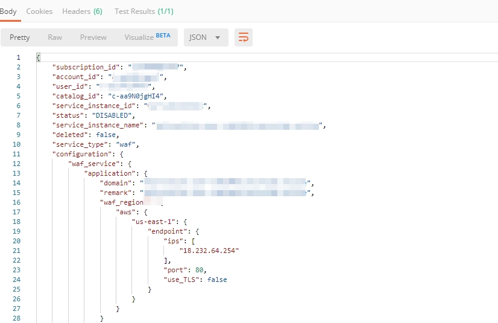

The retrieved "subscription_id" is then stored for subsequent calls.

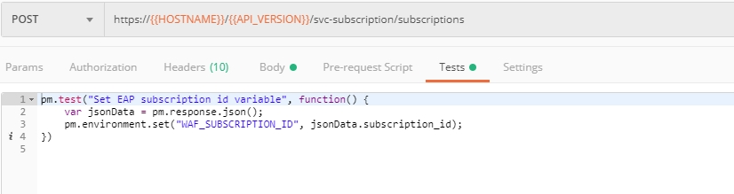

You can change its status from "DISABLED” to "ACTIVE” sending the **Activate EAP Subscription** request below.

More detailed information on this API request can be found `here <http://bit.ly/36fvHLX>`_.

2. Activate EAP Subscription
***************************

Now let’s activate the subscription created in the step above. Select the **Activate EAP Subscription** request and click **Send**. This will deploy Essential App Protect service using “subscription_id” captured in one of the steps above.

.. figure:: _figures/64.jpg

You will see “active” subscription status.

Note that it takes some time to deploy the service, so you can just re-send the same request after a few minutes to see “service_state”: “DEPLOYED”.

More detailed information on this API request can be found `here <http://bit.ly/36h6tgj>`_.

3. Get EAP Subscription
***********************

In order to direct your site’s traffic through Essential App Protect service you need to get “CNAMEValue” using “subscription_id” from the previous steps. The CNAME value will then be used to update the DNS record of the app you're protecting, which will then direct traffic to the instance of Essential App Protect that you created. To get "CNAMEValue", send the **Get EAP Subscription** request.

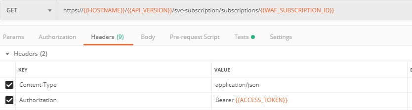

You will see the information for the service and “CNAMEValue”.

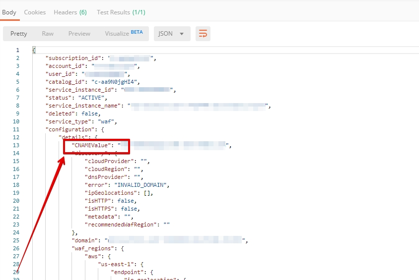

“CNAMEValue” and "service_instance_id" are then stored for subsequent calls.

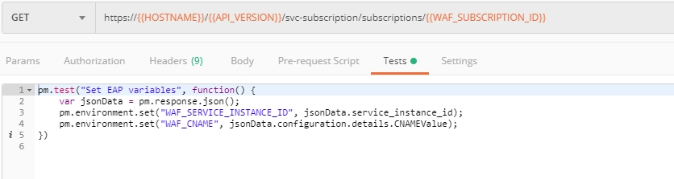

More detailed information on this API request can be found `here <http://bit.ly/38xUHjc>`_.

** THIS LAST STEP MAY TAKE SOME TIME TO COMPLETE **

4. Update EAP CNAME (lab)
************************

Now let’s update our DNS settings with the new CNAME. It can be easily done by sending the **Update EAP CNAME (lab)** request. This will direct all of the requests through Essential App Protect first. You can inspect the JSON body for the details of the current configuration. Note, that we have chosen to start with the "Monitor" mode first, which we will subsequently update to "Block".

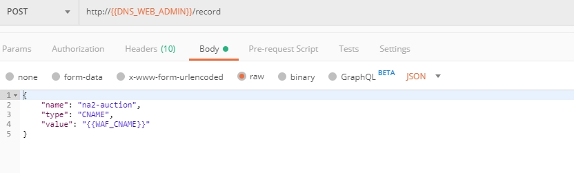

You will see “ok” status in the body if it is executed successfully.

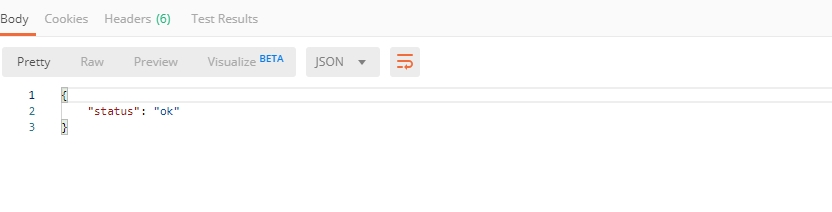

5. Check the Site
*****************

Now let’s see how our site looks like in a browser. Copy “CNAMEValue” from the **Get EAP Subscription** request and paste it into your browser.

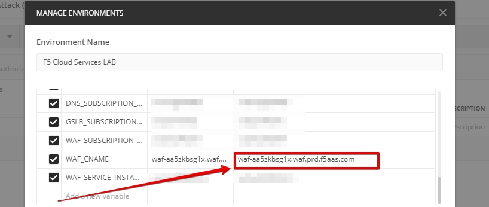

You will see the NA2 instances of the Auction website and all of the requests will now be flowing through the Essential App Protect. However, any malicious requests will not be blocked, as we have not yet turned on "Blocking" mode yet.

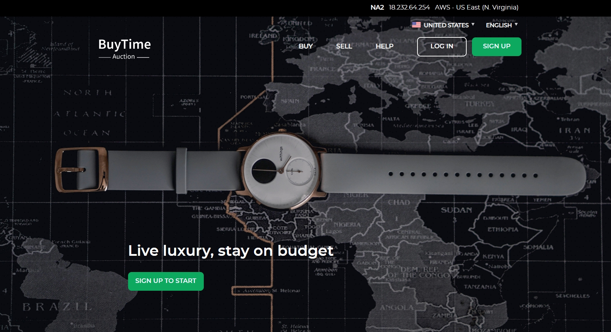

6. Start Essential App Protect Attack (lab)
*******************************************

Let’s now return to Postman and simulate the attacks by sending the **Start EAP Attack (lab)** request.

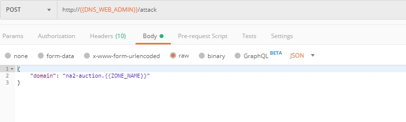

You will see “ok” status which means that your zone is being attacked.  In the F5 Cloud Services portal you can see the results of the attacks: their types, severity and some other information (see the next step).

7. Check the Map
****************

Now let’s see the map of our attacks on the F5 Cloud Services portal. You need to select **Essential App Protect** tab where you will see the dashboard.

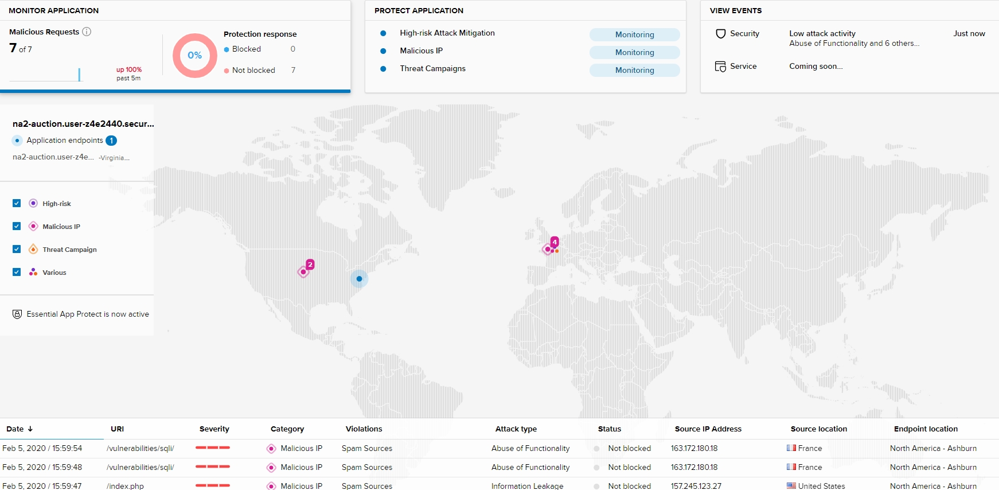

For now, all attacks are not blocked. We will block them sending the **Update Monitor to Block** request in one of the following steps.

8. Get Essential App Protect Events Stream
********************************************

Now return to Postman to get more detailed information on the simulated attacks. Send the **Get EAP Events Stream** request which uses “subscription_id” and “service_instance_id”.

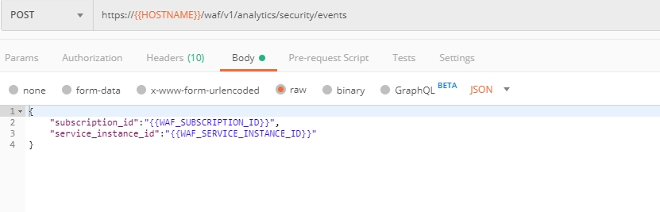

You can see different attack characteristics in the response, including type, country, source IPs, etc.

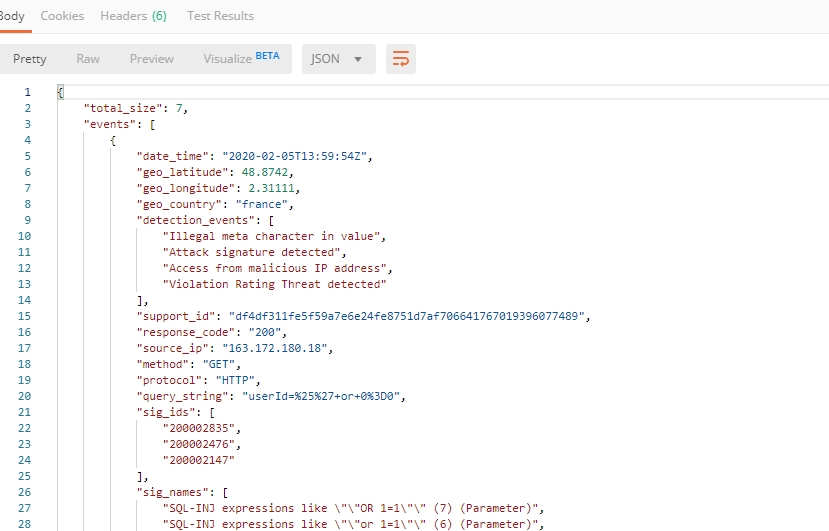

9. Update Monitoring to Blocking
********************************

To change your instance from "Monitoring" to "Blocking" run **Update Monitor to Block** request which uses your “subscription_id” retrieved in one of the previous steps. You may also want to re-run attacks activated by the **Start EAP Attack (lab)** request as discussed above and observe the change of behavior in the Essential App Protect "View Events" screen.

** **This may take a few seconds** **

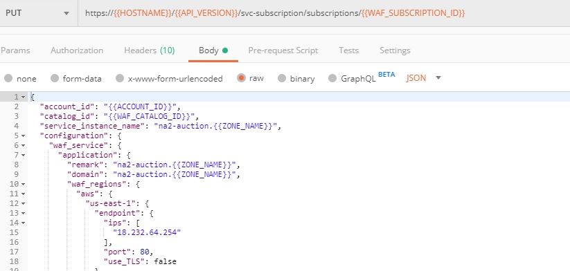

You will see blocked attacks and their information in the response.

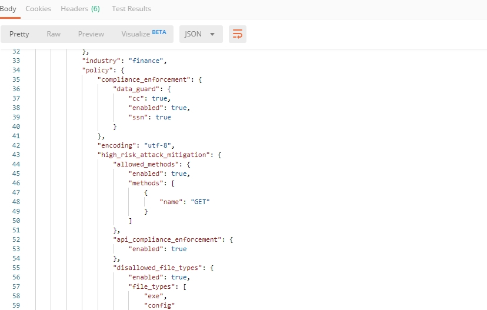

10. Attacks
***********

In this section you can use Postman to initiate a few types of attacks using the GET method against the protected NA2 instance. You can also choose to run your own attacks against the protected instance (CNAME retrieved earlier) by using a browser or tools of your choice.

`a)` SQL Injection

This attack inserts a SQL query via the input data field in the web application. Such attacks could potentially read sensitive data, modify and destroy it. More detailed information can be found `here <http://bit.ly/2RfmXkw>`_.

You can simulate this attack from your local computer by selecting the **Attack: SQL Injection** request and clicking **Send**.

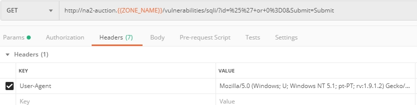

The result will be shown in the Essential App Protect "VIEW EVENTS" section of the F5 Cloud Services portal.

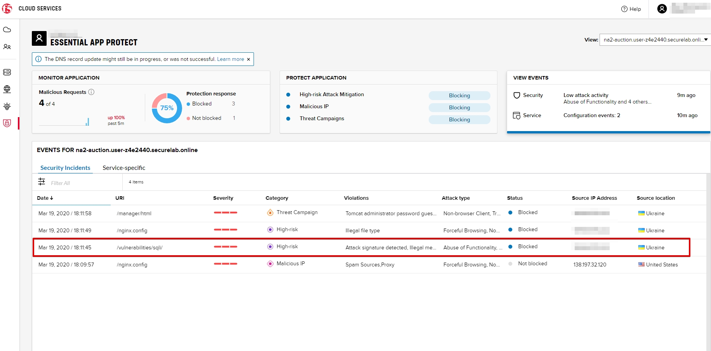

`b)` Illegal Filetype

This attack combines valid URL path segments with invalid input to guess or brute-force download of sensitive files or data. More detailed information can be found `here <http://bit.ly/30NrAFF>`_.

You can simulate this attack from your local computer by selecting the **Attack: Illegal Filetype** request and clicking **Send**.

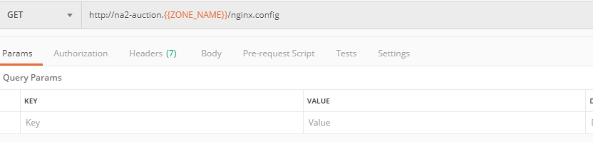

The result will be shown in the Essential App Protect "VIEW EVENTS" section of the F5 Cloud Services portal.

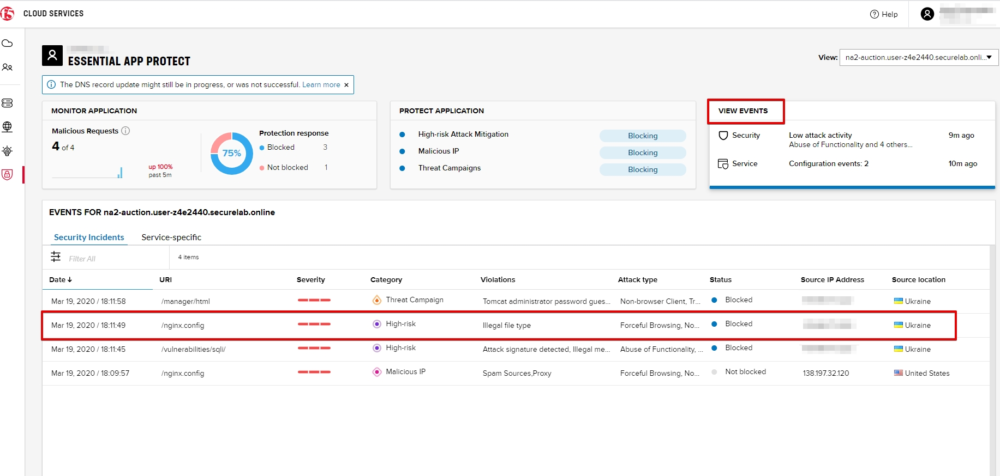

`c)` Threat Campaign

These types of attacks are the category that F5 Labs tracks as coordinated campaigns that exploit known vulnerabilities. This particular attack simulates using a known Tomcat backdoor vulnerability. The complete list of such threats can be found `here <http://bit.ly/36bPmfG>`_.

You can simulate this attack from your local computer by selecting the **Attack: Threat Campaign** request and clicking **Send**.

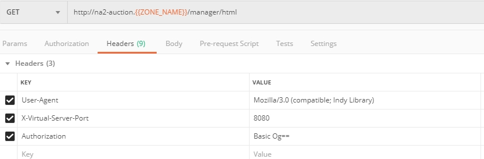

The result will be shown in the Essential App Protect "VIEW EVENTS" section of the F5 Cloud Services portal.

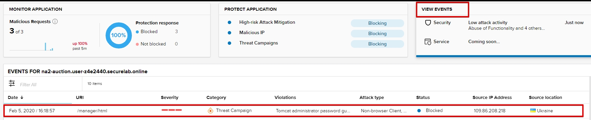

Clean Up
#########

1. Retire the Services
**********************

At this point feel free to explore and repeat any of the previous steps of the lab, but should you want to clean up the resources you've created and remove your service **Subscriptions**, then follow the steps below:

`a)` DNS

Send the **Retire DNS Subscription** request which uses the relevant “subscription_id”.

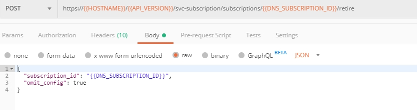

You will see “retired” status in the response body which means that it’s not available on the F5 Cloud Services portal anymore.

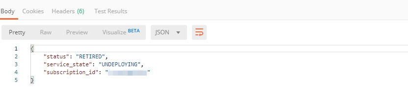

More detailed information on these API requests can be found `here <http://bit.ly/2Gf166I>`_.

`b)` DNS Load Balancer

Send the **Retire GSLB Subscription** request which uses the relevant “subscription_id”.

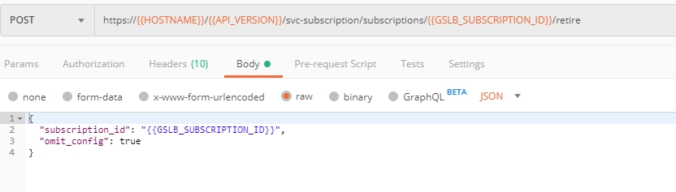

You will see “retired” status in the response body which means that it’s not available on the F5 Cloud Services portal anymore.

More detailed information on these API requests can be found `here <http://bit.ly/2Gf166I>`_.

`c)` Essential App Protect

Send the **Retire EAP Subscription** request which uses the relevant “subscription_id”.

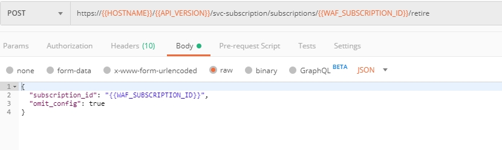

You will see “retired” status in the response body which means that it’s not available on the F5 Cloud Services portal anymore.

More detailed information on these API requests can be found `here <http://bit.ly/2Gf166I>`_.

2. Clear Tokens from the Lab Service API
************************

`a)` If you created a limited user role, we recommend that you clear your **LIMITED_ACCESS_TOKEN** from the Lab Service API for security purposes.

In order to do that, send the **Limited User Logout** request, which uses your **LIMITED_ACCESS_TOKEN**:

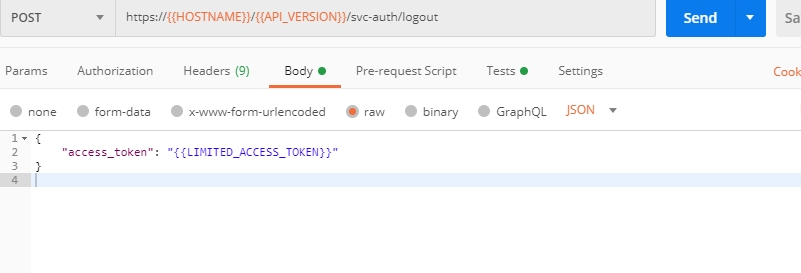

You will get the following response with the status showing "200 OK":

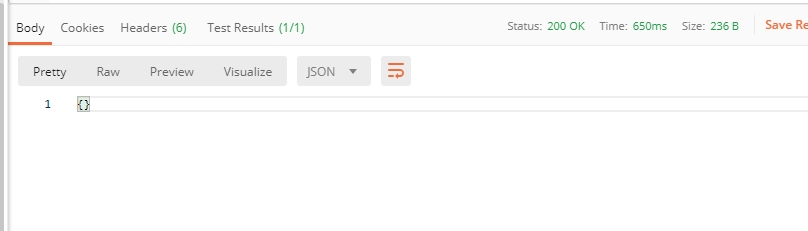

Your **LIMITED_ACCESS_TOKEN** will be considered invalid:

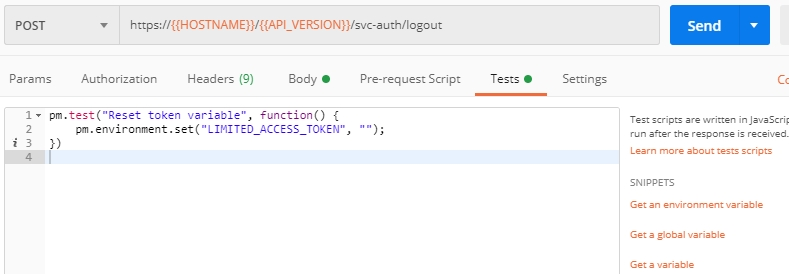

`b)` If you didn’t create a limited user role and used your main user credentials instead (“ACCESS_TOKEN” AS “LIMITED_ACCESS_TOKEN”) in steps 6 and 7 of **Core API Calls** section, we recommend that you clear your tokens from the Lab Service API for security purposes.

In order to do that, send the **Logout** request, which uses your **ACCESS_TOKEN**:

.. figure:: _figures/108.png

You will get the following response with the status showing "200 OK":

Your **ACCESS_TOKEN** will be considered invalid:

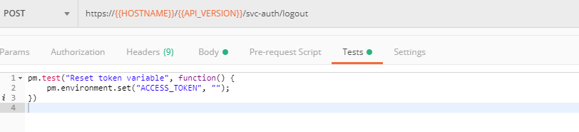

Final Notes
###########

By this point you would have done the following:

* Configured Postman account used for sending API requests to F5 Cloud Services and Lab Service

* Created app infrastructure using F5 Cloud Services

* Setup the following F5 Cloud Services by sending API requests in Postman: DNS, DNS Load Balancer and Essential App Protect

* Created your zone which was used as the domain name to work with the F5 Cloud Services portal

* Subscribed to the services and created secondary DNS for your primary one, endpoints and pools across Azure and AWS clouds for DNS Load Balancer

* Set Essential App Protect instance and let all requests to the main domain go through it first

* Simulated attacks of various types to verify the performance of Essential App Protect

* Had fun with F5 Cloud Services!

Feedback / Comments
###################
